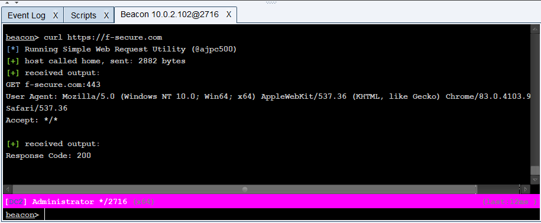
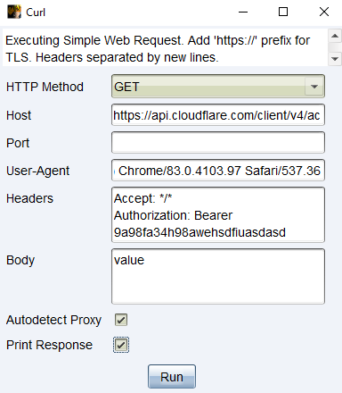

## Simple Web Utility BOF




Beacon object file and associated aggressor to make simple web requests without establishing SOCKS PROXY. Example use case could be confirming outbound access to specific service before deploying a relay from [F-Secure's C3](https://github.com/FSecureLABS/C3).

## Compile

```
make
```

## Usage

Aggressor script included with a command line function and a menu item for more complicated requests.

### Examples

Simple request to confirm a 200 response:

```
beacon> curl https://f-secure.com
[*] Running Simple Web Request Utility (@ajpc500)
[+] host called home, sent: 2882 bytes
[+] received output:
GET f-secure.com:443 
User Agent: Mozilla/5.0 (Windows NT 10.0; Win64; x64) AppleWebKit/537.36 (KHTML, like Gecko) Chrome/83.0.4103.97 Safari/537.36
Accept: */*

[+] received output:
Response Code: 200
```

Simple GET request that prints output (print is useful for calls to web APIs, a bad idea against a Javascript-heavy webpage!):

```
beacon> curl http://example.com 80 GET --show
[*] Running Simple Web Request Utility (@ajpc500)
[+] host called home, sent: 2880 bytes
[+] received output:
GET example.com:80 
User Agent: Mozilla/5.0 (Windows NT 10.0; Win64; x64) AppleWebKit/537.36 (KHTML, like Gecko) Chrome/83.0.4103.97 Safari/537.36
Accept: */*

[+] received output:
Response Code: 200

[+] received output:
<!doctype html>
<html>
<head>
    <title>Example Domain</title>
...
```